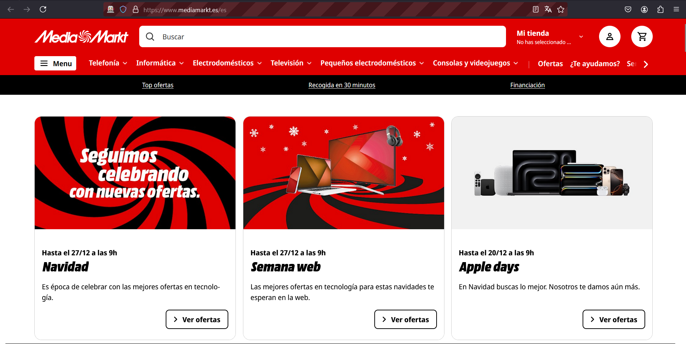

# UI Testing Project
### Autors: 
Arnau Muñoz Barrera (1665982) &
José Ortín López (1667573)

Web performance testing.

### Prerequisites
- Java Development Kit (JDK) 8 or higher.
- Maven for dependency management.
- An IDE like IntelliJ IDEA, Visual Studio Code or Eclipse for Java Developers.

# Website to analize
MediaMarkt: [MediaMarkt](https://www.mediamarkt.es/es?ds_rl=1275860&gad_source=1&gclid=EAIaIQobChMI9cju8OSIigMV66doCR27jC3GEAAYASAAEgIS2_D_BwE&gclsrc=aw.ds&utm_campaign=rt_search_brand_nsp_na_MM-ES-S-G-BRAND-TEXT-BRAND-PURE.BRAND-ALL-ALL&utm_medium=cpc&utm_source=google)

## Warning
Due to the fact that MediaMarkt's website is a living website that can be modified and updated constantly, 
some tests may fail due to the changes on the product database (articles can dissapear or change order).

Also, due to being changed for special dates and moments, sometimes MediaMarkt show 2 variants of the same website, fact that we don't control on our test.
The test code is only implemented for this distribution of the website's Home Page:

Any other distribution will cause errors. To check the correct implementation, re-execute the tests until you get the correct distribution of the landing page.



# UI Example
This project demonstrates how to implement the UI testing.

The UI is a software testing practice that evaluates the interface where users interact with a software or application.
It focuses on ensuring the visual elements, functionality, and usability of interfaces like Graphical User Interface (GUI), 
Command Line Interface (CLI), and Voice User Interface (VUI) are optimal and error-free.

# Selenium Web Driver
Is a browser automation framework that enables testing of web applications across various browsers and operating systems. 
It allows developers to write tests in their preferred programming language and execute them on different browsers, including Chrome, Firefox, Edge, Safari, and Internet Explorer.

# Gherkin
Is a browser automation framework that enables testing of web applications across various browsers and operating systems. 
It allows developers to write tests in their preferred programming language and execute them on different browsers, including Chrome, Firefox, Edge, Safari, and Internet Explorer.

### Setup

**Clone the repository**:
    ```sh
    git clone <repository-url>
    cd <repository-directory>
    ```
